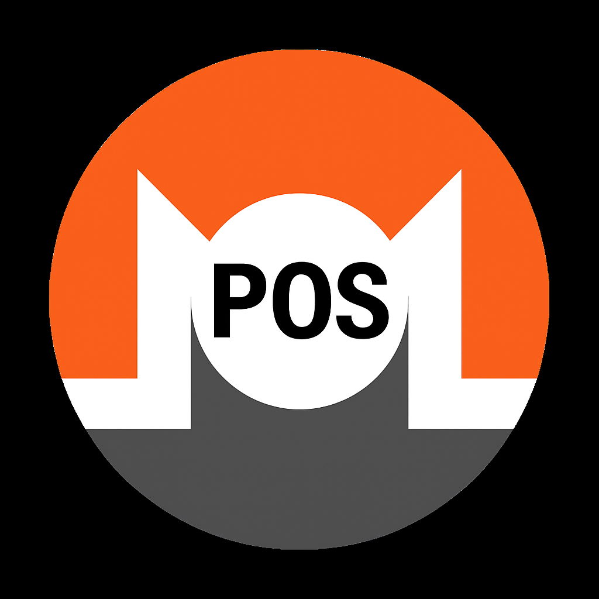
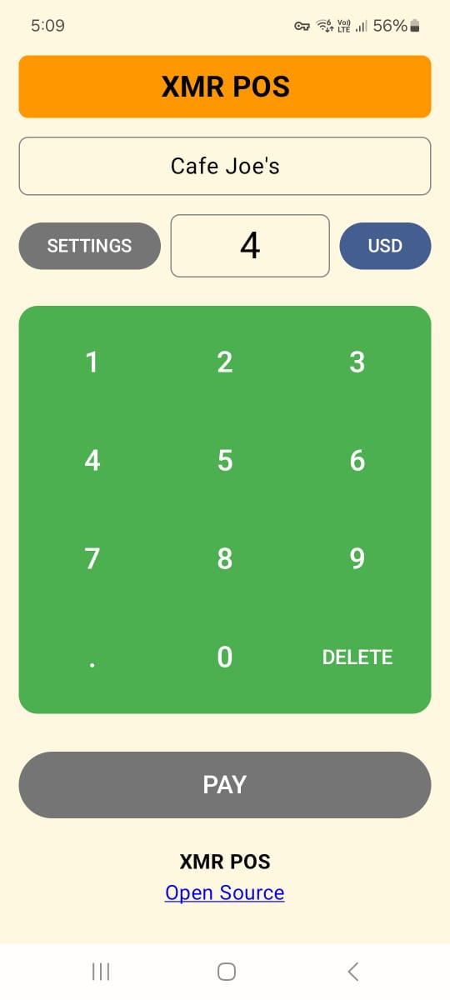
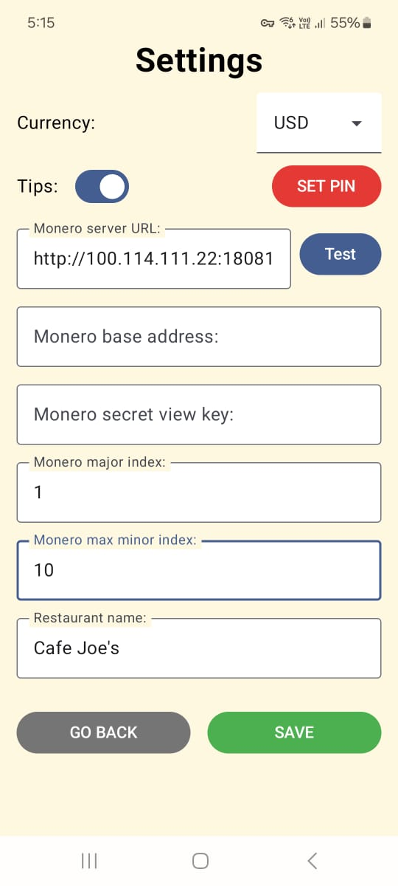
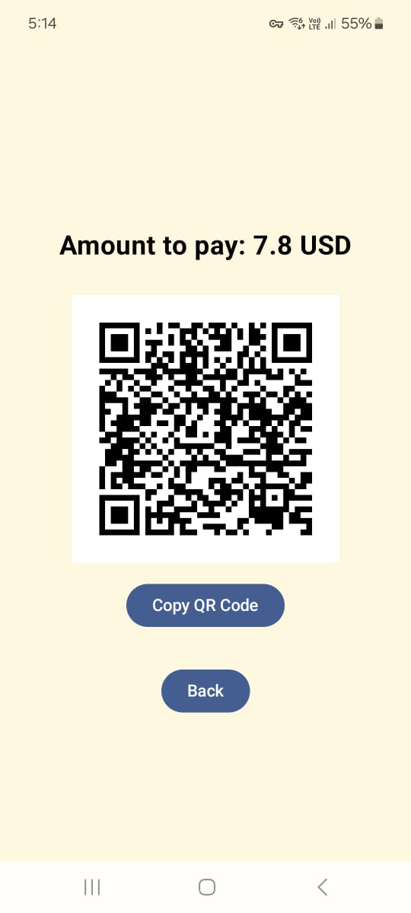

# 🚀 XMR POS

  

**XMR POS** is a **non-custodial Monero Point-of-Sale app** that allows merchants to accept payments in Monero with full privacy and security. The app is **already available on Google Play**, providing a seamless and private crypto checkout experience.

---

## 📲 Features

- 🔒 **Full Privacy**: Your Monero Base Address and Secret View Key **never leave the device**.
- ⚡ **Direct Node Connection**: Connects to your own Monero Node or a trusted node.
- 🏷️ **Multiple Accounts & Subaddresses**: Easily manage different payment accounts.
- 📦 **Offline-Ready**: Works even with intermittent internet connectivity.
- 💰 **Fast and Secure Transactions**: Powered by Monero’s robust privacy-focused blockchain.

---

## 📥 Installation

Get it directly from [Google Play](https://play.google.com/store/apps/details?id=cl.icripto.xmrpos):

  

---

## 🛠️ Setup

1. Install **XMR POS** on your Android device.
2. Open the app and go to **Settings → Node & Wallet**.
3. Enter your:
    - Monero Node URL (your node or a public one)
    - Base Address
    - Secret View Key
4. Start accepting Monero payments instantly!

> ⚠️ Your Secret View Key **never leaves your device**. Privacy is fully preserved.

---

## 💡 How It Works

1. Customer selects **Monero** as payment.
2. XMR POS generates a **unique subaddress** for the transaction.
3. Customer sends XMR.
4. App verifies payment and confirms instantly.

---

## 📊 Screenshots

  
  
  

---

## 🤝 Contributing

We welcome contributions! Please follow these steps:

1. Fork the repository
2. Create a branch (`git checkout -b feature-name`)
3. Commit your changes (`git commit -m 'Add feature'`)
4. Push to the branch (`git push origin feature-name`)
5. Open a Pull Request

---

## 📄 License

This project is licensed under the MIT License. See the [LICENSE](LICENSE) file for details.

---

## 💬 Contact

If you have questions or suggestions, reach out via GitHub Issues

---

## 💬 Donations

If you find this contribution useful, consider donating:

89gjKVSYpkjMoMMpBENvJmVyXSFSLhyw81oT852wvyJygQx9aPteYGDZwLDsuqi6ED7FpHurjRuaNUWGzdYoYyuyCSamB4R

---

Made with ❤️ for the Monero community.
